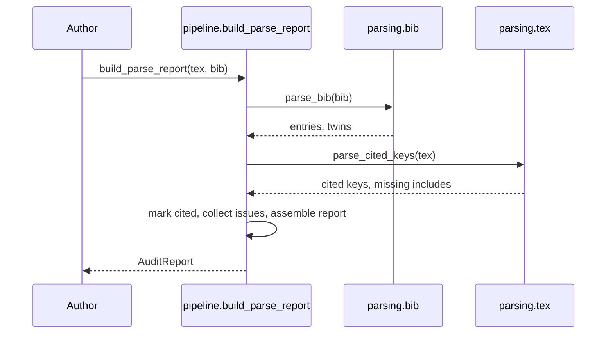
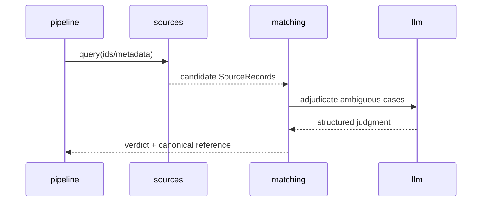

# Technical Design — Reference Audit


<!-- toc -->

- [1. Architecture Overview](#1-architecture-overview)
  - [1.1 Architectural Vision](#11-architectural-vision)
  - [1.2 Architecture Drivers](#12-architecture-drivers)
  - [1.3 Architecture Layers](#13-architecture-layers)
- [2. Principles & Constraints](#2-principles--constraints)
  - [2.1 Design Principles](#21-design-principles)
  - [2.2 Constraints](#22-constraints)
- [3. Technical Architecture](#3-technical-architecture)
  - [3.1 Domain Model](#31-domain-model)
  - [3.2 Component Model](#32-component-model)
  - [3.3 API Contracts](#33-api-contracts)
  - [3.4 Internal Dependencies](#34-internal-dependencies)
  - [3.5 External Dependencies](#35-external-dependencies)
  - [3.6 Interactions & Sequences](#36-interactions--sequences)
  - [3.7 Database schemas & tables](#37-database-schemas--tables)
- [4. Additional context](#4-additional-context)
- [5. Traceability](#5-traceability)

<!-- /toc -->

- [ ] `p3` - **ID**: `cpt-referenceaudit-design-overview`
## 1. Architecture Overview

### 1.1 Architectural Vision

Reference Audit is a Python library plus CLI organized as a staged pipeline over a small set of
pydantic domain models. The implemented slice (M1) is a synchronous, offline parse path:
`build_parse_report` orchestrates `.bib` parsing, `.tex` citation extraction, identifier
normalization, and deterministic issue collection into an `AuditReport`.

Later milestones extend the pipeline with modular database adapters (sources), feature scoring and a
same-object disambiguation rule (matching), an LLM adjudication funnel (llm), and SQLite memoization
(cache). The architecture isolates each concern behind a package boundary so the offline parse slice
stays dependency-light and the network/LLM stages can be added without disturbing it.

### 1.2 Architecture Drivers

Requirements that significantly influence architecture decisions.

#### Functional Drivers

| Requirement | Design Response |
|-------------|------------------|
| `cpt-referenceaudit-fr-parse-bib-tex` | The `parsing` package + `build_parse_report` orchestration produce a structured `AuditReport` offline. |
| `cpt-referenceaudit-fr-identify-artifact` | The `sources` package (modular DB adapters) returns candidate `SourceRecord`s, preferring DOI/ISBN/URL. |
| `cpt-referenceaudit-fr-three-way-verdict` | The `matching` package collapses candidates into a `none` / `exactly_one` / `multiple` verdict. |
| `cpt-referenceaudit-fr-hallucination-screen` | `matching` + `llm` adjudication drive empty candidate sets to a confident `none`. |
| `cpt-referenceaudit-fr-best-version-canonical` | `matching` ranks versions (published > preprint, later editions) and `report` emits the canonical reference. |

#### NFR Allocation

| NFR ID | NFR Summary | Allocated To | Design Response | Verification Approach |
|--------|-------------|--------------|-----------------|----------------------|
| `cpt-referenceaudit-nfr-offline-deterministic` | Parse slice is offline + deterministic | `parsing`, `pipeline` | No network imports in the parse path; pure functions over file inputs. | Unit tests run with no network. |
| `cpt-referenceaudit-nfr-cached-calls` | Memoize DB/LLM calls | `cache` | SQLite-backed memoization wrapping source/LLM calls. | Integration test asserts cache hits on repeat. |

### 1.3 Architecture Layers

```text
CLI / report  ->  pipeline (orchestration)  ->  parsing | sources | matching | llm
                                              \->  models (shared)   \-> cache
```

- [ ] `p3` - **ID**: `cpt-referenceaudit-tech-python`

| Layer | Responsibility | Technology |
|-------|---------------|------------|
| Presentation | CLI entry point and report rendering | Python `argparse`, `report.py` |
| Application | Pipeline orchestration (parse → identify → score → adjudicate → verdict) | `pipeline.py` |
| Domain | Bib/citation/source/feature models | `pydantic` models |
| Infrastructure | DB adapters, LLM client, SQLite cache | `sources`, `llm`, `cache` (planned) |

## 2. Principles & Constraints

### 2.1 Design Principles

#### Offline-first parse slice

- [x] `p1` - **ID**: `cpt-referenceaudit-principle-offline-first`

The parse path must perform no network I/O and must be deterministic, so it can run in air-gapped CI
and forms a stable foundation for the networked stages.

#### Modular, swappable sources

- [ ] `p2` - **ID**: `cpt-referenceaudit-principle-modular-sources`

Each bibliographic database is a self-contained adapter behind a common interface, so sources can be
added, removed, or reordered without touching matching or pipeline code.

### 2.2 Constraints

#### Identifier preference order

- [ ] `p1` - **ID**: `cpt-referenceaudit-constraint-id-preference`

Identification must prefer DOI for papers, ISBN for books, and URL for other artifacts; metadata
matching is only a fallback when no strong identifier resolves.

#### No-network parse path

- [x] `p1` - **ID**: `cpt-referenceaudit-constraint-no-network-parse`

The `parsing` package and `build_parse_report` must not import or invoke any networking code; all
network access is confined to the `sources` and `llm` packages.

## 3. Technical Architecture

### 3.1 Domain Model

**Technology**: pydantic models

**Location**: [models.py](../src/reference_audit/models.py)

**Core Entities**:

| Entity | Description | Schema |
|--------|-------------|--------|
| BibEntry | A parsed `.bib` entry with normalized `Identifiers`. | [models.py](../src/reference_audit/models.py) |
| Identifiers | Normalized DOI / ISBN13 / arXiv / URL / PMID. | [models.py](../src/reference_audit/models.py) |
| EntryAudit | A `BibEntry` plus its verdict and issue list. | [models.py](../src/reference_audit/models.py) |
| AuditReport | The aggregate report (entries + bookkeeping + summary). | [models.py](../src/reference_audit/models.py) |
| SourceRecord | A candidate artifact returned by a database adapter (planned). | [models.py](../src/reference_audit/models.py) |

**Relationships**:
- AuditReport → EntryAudit: contains one audit per parsed entry.
- EntryAudit → BibEntry → Identifiers: each audit wraps one entry, which owns its identifiers.

### 3.2 Component Model

```text
parsing -> models <- pipeline -> sources -> cache
                         |-> matching -> llm
                         |-> report / cli
```

#### parsing

- [x] `p1` - **ID**: `cpt-referenceaudit-component-parsing`

##### Why this component exists

To turn raw `.bib` and `.tex` text into clean structured data (entries, cited keys, normalized
identifiers) so every downstream stage works against models instead of LaTeX/BibTeX syntax.

##### Responsibility scope

Parse `.bib` into `BibEntry`s (`parsing/bib.py`), extract cited keys and resolve includes from
`.tex` (`parsing/tex.py`), and normalize DOI/ISBN/arXiv identifiers (`parsing/identifiers.py`).
Detect commented preprint twins. **IMPLEMENTED (M1).**

##### Responsibility boundaries

Does no network I/O, no database lookups, and no verdict computation; it only produces normalized
structured data.

##### Related components (by ID)

- `cpt-referenceaudit-component-models` — depends on (produces `BibEntry` / `Identifiers`)

#### models

- [x] `p1` - **ID**: `cpt-referenceaudit-component-models`

##### Why this component exists

To provide a single shared, validated domain vocabulary used by every other component.

##### Responsibility scope

Define pydantic models (`BibEntry`, `Identifiers`, `EntryAudit`, `AuditReport`, `SourceRecord`,
`FeatureVector`, `EntryType`) and the bib-type mapping. **IMPLEMENTED.**

##### Responsibility boundaries

Holds no behavior beyond validation and small derived helpers; performs no I/O.

##### Related components (by ID)

- `cpt-referenceaudit-component-parsing` — shares model with

#### sources

- [ ] `p2` - **ID**: `cpt-referenceaudit-component-sources`

##### Why this component exists

To query external bibliographic databases and return candidate artifacts for identification.

##### Responsibility scope

Modular adapters (Crossref, OpenAlex, Semantic Scholar, arXiv, OpenLibrary, ...) producing
`SourceRecord`s behind a common interface. **PLANNED (M2–M3).**

##### Responsibility boundaries

Performs no scoring or verdict logic; returns raw candidates only.

##### Related components (by ID)

- `cpt-referenceaudit-component-cache` — depends on (memoizes queries)
- `cpt-referenceaudit-component-matching` — publishes to (provides candidates)

#### matching

- [ ] `p1` - **ID**: `cpt-referenceaudit-component-matching`

##### Why this component exists

To decide, from candidate records, whether a reference matches no artifact, exactly one, or multiple
— the heart of the audit — and to select the best version.

##### Responsibility scope

Feature scoring (`FeatureVector`) and the same-object disambiguation rule; produces the 3-way verdict
and ranks versions. **PLANNED (M3–M5).**

##### Responsibility boundaries

Does not call databases directly (consumes candidates from `sources`) and does not render output.

##### Related components (by ID)

- `cpt-referenceaudit-component-sources` — subscribes to (consumes candidates)
- `cpt-referenceaudit-component-llm` — calls (adjudication funnel)

#### llm

- [ ] `p2` - **ID**: `cpt-referenceaudit-component-llm`

##### Why this component exists

To adjudicate ambiguous matches that feature scoring cannot resolve on its own.

##### Responsibility scope

OpenAI structured-output adjudication funnel invoked by `matching` for hard cases. **PLANNED (M4).**

##### Responsibility boundaries

Stateless with respect to the audit; returns structured judgments, never final report formatting.

##### Related components (by ID)

- `cpt-referenceaudit-component-cache` — depends on (memoizes LLM calls)

#### cache

- [ ] `p2` - **ID**: `cpt-referenceaudit-component-cache`

##### Why this component exists

To bound cost and latency by memoizing slow, metered database and LLM calls.

##### Responsibility scope

SQLite-backed memoization of source and LLM responses. **PLANNED (M2).**

##### Responsibility boundaries

Stores and retrieves responses only; contains no audit logic.

##### Related components (by ID)

- `cpt-referenceaudit-component-sources` — owns data for (cached query results)

#### report-cli

- [x] `p1` - **ID**: `cpt-referenceaudit-component-report-cli`

##### Why this component exists

To present the `AuditReport` to humans and machines and to provide the program entry point.

##### Responsibility scope

`report.py` renders JSON/text; `cli.py` parses arguments and runs the (parse-only) audit.
**IMPLEMENTED (parse-only).**

##### Responsibility boundaries

Contains no parsing, matching, or network logic; only formats results and wires the entry point.

##### Related components (by ID)

- `cpt-referenceaudit-component-parsing` — calls (via pipeline orchestration)

### 3.3 API Contracts

The public surface is the `build_parse_report` library function and the `reference-audit` CLI.

This realizes the PRD public interface `cpt-referenceaudit-interface-parse-report`.

- [ ] `p2` - **ID**: `cpt-referenceaudit-interface-cli`

- **Implements (PRD)**: `cpt-referenceaudit-interface-parse-report`
- **Contracts**: `cpt-referenceaudit-contract-database-query`
- **Technology**: Python function call + CLI (argparse)
- **Location**: [pipeline.py](../src/reference_audit/pipeline.py)

**Endpoints Overview**:

| Method | Path | Description | Stability |
|--------|------|-------------|-----------|
| `CALL` | `build_parse_report(tex_path, bib_path)` | Parse-only audit returning an `AuditReport`. | unstable |
| `CLI` | `reference-audit audit` | Run the parse-only audit from the command line. | unstable |

### 3.4 Internal Dependencies

| Dependency Module | Interface Used | Purpose |
|-------------------|----------------|----------|
| models | pydantic models | Shared domain vocabulary for all components |
| parsing | `parse_bib`, `parse_cited_keys` | Produce entries + cited keys for the pipeline |

**Dependency Rules** (per project conventions):
- No circular dependencies.
- The parse path imports only `models` and `parsing`.

### 3.5 External Dependencies

External libraries and services this module interacts with.

#### Bibliographic databases & parsing libraries

| Dependency Module | Interface Used | Purpose |
|-------------------|---------------|---------|
| bibtexparser | `loads` / `db.entries` | Parse `.bib` source |
| pydantic | `BaseModel` | Validated domain models |
| Crossref / OpenAlex / S2 / arXiv / OpenLibrary | HTTPS JSON APIs | Candidate identification (planned) |

**Dependency Rules** (per project conventions):
- Only the `sources` and `llm` components talk to external network services.
- The parse path has no external network dependencies.

### 3.6 Interactions & Sequences

#### Build parse report

- [x] `p1` - **ID**: `cpt-referenceaudit-seq-build-parse-report`

**Use cases**: `cpt-referenceaudit-usecase-parse-audit`

**Actors**: `cpt-referenceaudit-actor-author`



**Description**: The implemented offline path that produces an `AuditReport` from `.bib` + `.tex`.

#### Identify and adjudicate (planned)

- [ ] `p2` - **ID**: `cpt-referenceaudit-seq-identify-adjudicate`

**Use cases**: `cpt-referenceaudit-usecase-parse-audit`

**Actors**: `cpt-referenceaudit-actor-database`



**Description**: The planned networked path layered on top of the parse slice (M2–M5).

### 3.7 Database schemas & tables

No persistent database is used in the implemented slice. The planned `cache` component uses SQLite.

- [ ] `p3` - **ID**: `cpt-referenceaudit-db-cache`

#### Table: response_cache (planned; SQLite)

**ID**: `cpt-referenceaudit-dbtable-response-cache`

**Schema**:

| Column | Type | Description |
|--------|------|-------------|
| key | text | Hash of the source/LLM request |
| source | text | Adapter or `llm` that produced the response |
| response | text | Serialized response payload |
| fetched_at | text | ISO-8601 timestamp |

**PK**: `key`

**Constraints**: `key` UNIQUE NOT NULL.

**Additional info**: Planned (M2); not present in the implemented slice.

**Example**:

| key | source | response | fetched_at |
|--------|--------|--------|--------|
| 9f2a... | crossref | {...} | 2026-06-27T00:00:00Z |

## 4. Additional context

- PRD: [PRD.md](./PRD.md)
- Decomposition: [DECOMPOSITION.md](./DECOMPOSITION.md)

## 5. Traceability

- **PRD**: [PRD.md](./PRD.md)
- **ADRs**: [ADR/](./ADR/)
- **Features**: [features/](./features/)
