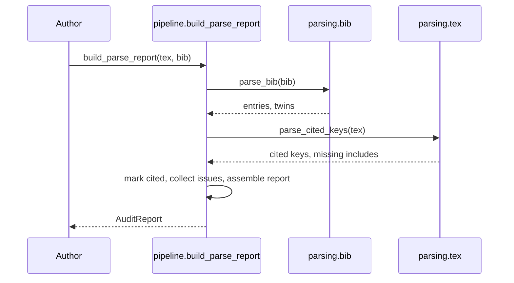
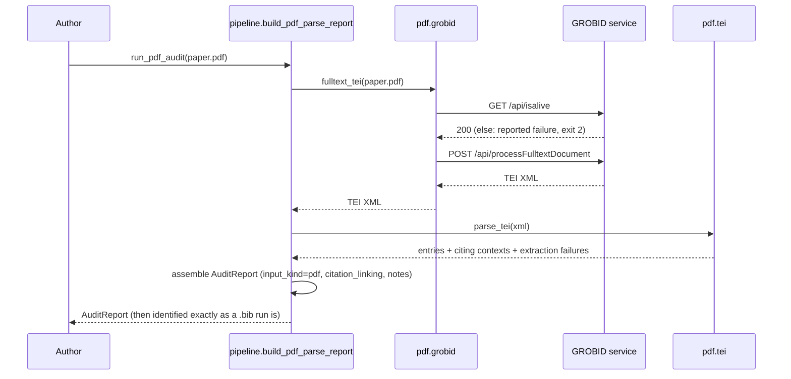
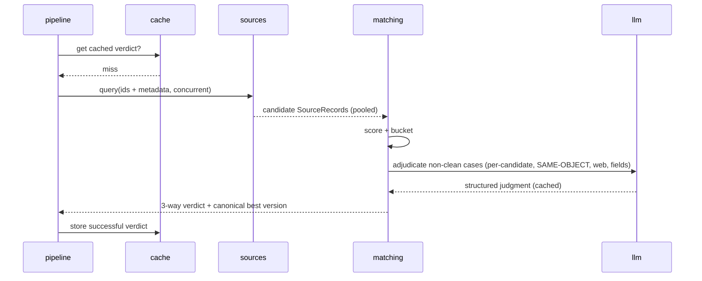

# Technical Design — Reference Audit


<!-- toc -->

- [1. Architecture Overview](#1-architecture-overview)
  - [1.1 Architectural Vision](#11-architectural-vision)
  - [1.2 Architecture Drivers](#12-architecture-drivers)
  - [1.3 Architecture Layers](#13-architecture-layers)
- [2. Principles & Constraints](#2-principles--constraints)
  - [2.1 Design Principles](#21-design-principles)
  - [2.2 Constraints](#22-constraints)
- [3. Technical Architecture](#3-technical-architecture)
  - [3.1 Domain Model](#31-domain-model)
  - [3.2 Component Model](#32-component-model)
  - [3.3 API Contracts](#33-api-contracts)
  - [3.4 Internal Dependencies](#34-internal-dependencies)
  - [3.5 External Dependencies](#35-external-dependencies)
  - [3.6 Interactions & Sequences](#36-interactions--sequences)
  - [3.7 Database schemas & tables](#37-database-schemas--tables)
- [4. Additional context](#4-additional-context)
- [5. Traceability](#5-traceability)

<!-- /toc -->

- [ ] `p3` - **ID**: `cpt-referenceaudit-design-overview`
## 1. Architecture Overview

### 1.1 Architectural Vision

Reference Audit is a Python library plus CLI organized as a staged pipeline over a small set of
pydantic domain models. The offline parse path is synchronous: `build_parse_report` orchestrates
`.bib` parsing, `.tex` citation extraction, identifier normalization, and deterministic issue
collection into an `AuditReport`.

On top of that foundation, the networked pipeline (`AuditPipeline.run` / `run_audit`) is implemented
as concurrent async per-entry processing: modular database adapters (sources), feature scoring and a
SAME-OBJECT disambiguation rule (matching), an LLM adjudication funnel (llm), URL-only web and Open
Library book verification, and SQLite memoization (cache). The architecture isolates each concern
behind a package boundary so the offline parse slice stays dependency-light and the network/LLM
stages stay swappable. Each entry is audited in isolation: a failure on one reference leaves it
`unresolved` (retried next run) and never aborts the others.

### 1.2 Architecture Drivers

Requirements that significantly influence architecture decisions.

#### Functional Drivers

| Requirement | Design Response |
|-------------|------------------|
| `cpt-referenceaudit-fr-parse-bib-tex` | The `parsing` package + `build_parse_report` orchestration produce a structured `AuditReport` offline. |
| `cpt-referenceaudit-fr-identify-artifact` | The `sources` package (modular DB adapters) returns candidate `SourceRecord`s, preferring DOI/ISBN/URL. |
| `cpt-referenceaudit-fr-three-way-verdict` | The `matching` package collapses candidates into a `none` / `exactly_one` / `multiple` verdict. |
| `cpt-referenceaudit-fr-hallucination-screen` | `matching` + `llm` adjudication drive empty candidate sets to a confident `none`. |
| `cpt-referenceaudit-fr-best-version-canonical` | `matching` ranks versions (published > preprint, later editions) and `report` emits the canonical reference. |
| `cpt-referenceaudit-fr-citation-alignment` | The `alignment` component pairs each citing context (from `parsing`) with the matched artifact's abstract and classifies it via `llm`; advisory, never changing the verdict. |
| `cpt-referenceaudit-fr-audit-pdf` | The `pdf` component (a thin GROBID HTTP client plus a pure TEI mapper) turns a PDF into the same `BibEntry` / `CitationContext` records the `.bib`/`.tex` front end produces, so everything downstream is unchanged. |

#### NFR Allocation

| NFR ID | NFR Summary | Allocated To | Design Response | Verification Approach |
|--------|-------------|--------------|-----------------|----------------------|
| `cpt-referenceaudit-nfr-offline-deterministic` | Parse slice is offline + deterministic | `parsing`, `pipeline` | No network imports in the parse path; pure functions over file inputs. | Unit tests run with no network. |
| `cpt-referenceaudit-nfr-cached-calls` | Memoize DB/LLM calls | `cache` | SQLite-backed memoization wrapping source/LLM calls. | Integration test asserts cache hits on repeat. |
| `cpt-referenceaudit-nfr-extraction-fidelity` | PDF reference extraction meets pinned fidelity floors and fabricates no identifier | `pdf` | Positional (printed order) plus identifier / normalized-title matching against the very `.bib` the PDF was compiled from; a DOI cut short by a line break is extended only from the reference's own text, never guessed. | Live-gated pinned-threshold comparison over locally compiled PDFs (`tests/test_pdf_extraction.py`); the pure TEI mapping is verified offline from recorded TEI. |

### 1.3 Architecture Layers

```text
CLI / report  ->  pipeline (orchestration)  ->  parsing | sources | matching | llm
                                              \->  models (shared)   \-> cache
```

- [ ] `p3` - **ID**: `cpt-referenceaudit-tech-python`

| Layer | Responsibility | Technology |
|-------|---------------|------------|
| Presentation | CLI entry point and report rendering | `typer` CLI, `report.py` |
| Application | Pipeline orchestration (parse → route → query → score → adjudicate → cluster → verdict → enrich) | `pipeline.py` (async) |
| Domain | Bib/citation/source/feature models | `pydantic` models |
| Infrastructure | DB/web adapters, LLM client, PDF extraction, SQLite cache | `sources`, `llm`, `pdf`, `cache` |

## 2. Principles & Constraints

### 2.1 Design Principles

#### Offline-first parse slice

- [x] `p1` - **ID**: `cpt-referenceaudit-principle-offline-first`

The parse path must perform no network I/O and must be deterministic, so it can run in air-gapped CI
and forms a stable foundation for the networked stages.

#### Network I/O and format mapping are separate

- [ ] `p1` - **ID**: `cpt-referenceaudit-principle-pure-tei-mapping`

The GROBID HTTP call lives in one thin module and the TEI-to-model mapping is a pure function of the
TEI text, so extraction correctness is verifiable offline from recorded TEI XML — the same
recorded-response discipline the source adapters follow. It is also what makes the compiled-PDF oracle
possible: the same mapper runs over a live response and over a committed fixture.

#### Modular, swappable sources

- [x] `p2` - **ID**: `cpt-referenceaudit-principle-modular-sources`

Each bibliographic database is a self-contained adapter behind a common interface (`sources/base.py`),
so sources can be added, removed, or reordered without touching matching or pipeline code.

### 2.2 Constraints

#### Identifier preference order

- [x] `p1` - **ID**: `cpt-referenceaudit-constraint-id-preference`

Identification must prefer DOI for papers, ISBN for books, and URL for other artifacts; metadata
matching always runs alongside (to backfill missing identifiers and corroborate), but a strong
identifier match takes precedence.

#### No-network parse path

- [x] `p1` - **ID**: `cpt-referenceaudit-constraint-no-network-parse`

The `parsing` package, the pure TEI mapper `pdf/tei.py`, and `build_parse_report` must not import or
invoke any networking code. Network access is confined to the `sources`, `llm`, and `pdf/grobid`
modules, and `parsing` must not import `pdf/grobid`.

A PDF input is the one case where assembling the entry list *itself* requires a network call — to a
GROBID service that turns the PDF into TEI. That call is made only by `pdf/grobid.py` and only from the
async `build_pdf_parse_report`, never from the synchronous `build_parse_report`. So `--no-network`
keeps its literal meaning and is accepted only for `.tex` + `.bib` input; combining it with a `.pdf` is
rejected rather than silently redefined as "no *remote* network", which would be a promise the tool
cannot keep once `grobid_url` may point anywhere.

#### GROBID is a local, opt-in service

- [ ] `p1` - **ID**: `cpt-referenceaudit-constraint-grobid-local-only`

PDF extraction must talk only to an operator-supplied GROBID instance (`grobid_url`, default
`http://localhost:8070`), must be reached only when the audited input is a PDF, and must request
`consolidateCitations=0` so GROBID performs no third-party lookups of its own — consolidation would let
it rewrite each reference from Crossref, repairing the very defects this tool exists to detect. No
public GROBID endpoint is ever a default. A PDF input with no reachable GROBID is an explicit, reported
failure, never a silently empty reference list.

## 3. Technical Architecture

### 3.1 Domain Model

**Technology**: pydantic models

**Location**: [models.py](../src/reference_audit/models.py)

**Core Entities**:

| Entity | Description | Schema |
|--------|-------------|--------|
| BibEntry | A parsed `.bib` entry with normalized `Identifiers`. | [models.py](../src/reference_audit/models.py) |
| Identifiers | Normalized DOI / ISBN13 (set-valued: `all_isbn13()` carries print+electronic) / arXiv / OpenAlex Work id / Google Books volume id / URL / PMID. | [models.py](../src/reference_audit/models.py) |
| EntryAudit | A `BibEntry` plus its verdict, issue list, and the reasons a verdict could not be reached (`unresolved_reasons`). | [models.py](../src/reference_audit/models.py) |
| UnparsedEntry | A live `.bib` entry the BibTeX parser could not read (key, type, line, reason); reported, never audited. | [models.py](../src/reference_audit/models.py) |
| AuditReport | The aggregate report (entries + bookkeeping, including unparsed entries, + summary). | [models.py](../src/reference_audit/models.py) |
| SourceRecord | A candidate artifact returned by a database/web adapter. | [models.py](../src/reference_audit/models.py) |
| Verdict / MatchedArtifact | The 3-way verdict and the clustered artifact(s) it resolves to. | [models.py](../src/reference_audit/models.py) |
| FieldFinding | A per-field correctness/formatting finding for an exactly-one match. | [models.py](../src/reference_audit/models.py) |
| CitationContext | One in-text citing occurrence of a key: the surrounding sentence(s) and location. | [models.py](../src/reference_audit/models.py) |
| AlignmentFinding | A per-citation alignment classification (supported / contradicted / not_in_abstract / unverifiable) with evidence. | [models.py](../src/reference_audit/models.py) |

**Relationships**:
- AuditReport → EntryAudit: contains one audit per parsed entry.
- EntryAudit → BibEntry → Identifiers: each audit wraps one entry, which owns its identifiers.

### 3.2 Component Model

```text
parsing -> models <- pipeline -> sources -> cache
                         |-> matching -> llm
                         |-> report / cli
```

> **Checkbox semantics:** `[x]` here means *implemented **and** traced to code* via `@cpt` markers.
> Today only `parsing`, `models`, and `report-cli` are `@cpt`-traced. The `sources`, `matching`,
> `llm`, and `cache` components are fully **implemented in code** but are not yet `@cpt`-traced, so
> they remain unchecked even though their scope notes below read *IMPLEMENTED*. Adding that
> traceability (and a `features/identification.md` spec) is the outstanding governance work.

#### parsing

- [x] `p1` - **ID**: `cpt-referenceaudit-component-parsing`

##### Why this component exists

To turn raw `.bib` and `.tex` text into clean structured data (entries, cited keys, normalized
identifiers) so every downstream stage works against models instead of LaTeX/BibTeX syntax.

##### Responsibility scope

Parse `.bib` into `BibEntry`s (`parsing/bib.py`), extract cited keys and resolve includes from
`.tex` (`parsing/tex.py`), and normalize DOI/ISBN/arXiv/OpenAlex-Work-id/Google-Books-volume-id
identifiers (`parsing/identifiers.py`).
Detect commented preprint twins. **IMPLEMENTED (M1).**

##### Responsibility boundaries

Does no network I/O, no database lookups, and no verdict computation; it only produces normalized
structured data.

##### Related components (by ID)

- `cpt-referenceaudit-component-models` — depends on (produces `BibEntry` / `Identifiers`)

#### models

- [x] `p1` - **ID**: `cpt-referenceaudit-component-models`

##### Why this component exists

To provide a single shared, validated domain vocabulary used by every other component.

##### Responsibility scope

Define pydantic models (`BibEntry`, `Identifiers`, `EntryAudit`, `AuditReport`, `SourceRecord`,
`FeatureVector`, `EntryType`) and the bib-type mapping. **IMPLEMENTED.**

##### Responsibility boundaries

Holds no behavior beyond validation and small derived helpers; performs no I/O.

##### Related components (by ID)

- `cpt-referenceaudit-component-parsing` — shares model with

#### sources

- [x] `p2` - **ID**: `cpt-referenceaudit-component-sources`

##### Why this component exists

To query external bibliographic databases and pages and return candidate artifacts for identification.

##### Responsibility scope

Modular adapters (Crossref, OpenAlex, Semantic Scholar, arXiv, DBLP, Open Library, Google Books, the
publisher DOI landing-page citation export, and a web page fetcher) producing `SourceRecord`s behind
a common interface, with per-entry routing by id vs. metadata. The web page fetcher additionally
detects JavaScript single-page-app shells (a served page with no readable content) and re-fetches
them through a headless browser (`render`) so the rendered page can be read; when no browser is
available the page is marked unrenderable rather than read as empty. **IMPLEMENTED.**

Semantic Scholar, OpenAlex and DBLP have two interchangeable backends, selected per run by
`source_backend`:
- their public APIs (DBLP through its SPARQL endpoint);
- a local ClickHouse mirror of the same databases (`sources/clickhouse.py`).

The local adapters keep the API adapters' names and normalizers. Title search uses a full-text index
on each table, with all words required and a leave-one-word-out retry when no hit is a near-exact
title. A preflight refuses a mirror that is unreachable or lacks a fully built index, and records how
far each snapshot reaches (`coverage_end`), which the pipeline cites next to a `none` verdict for a
recent entry. Cached responses are keyed per backend (`cache_source`). **IMPLEMENTED** (not yet
`@cpt`-traced).

##### Responsibility boundaries

Performs no scoring or verdict logic; returns raw candidates only. The publisher adapter is advisory
only (never an identity source), so a bot-walled publisher cannot mask a hallucinated DOI.

##### Related components (by ID)

- `cpt-referenceaudit-component-cache` — depends on (memoizes queries)
- `cpt-referenceaudit-component-matching` — publishes to (provides candidates)

#### matching

- [x] `p1` - **ID**: `cpt-referenceaudit-component-matching`

##### Why this component exists

To decide, from candidate records, whether a reference matches no artifact, exactly one, or multiple
— the heart of the audit — and to select the best version.

##### Responsibility scope

Candidate pooling, feature scoring (`FeatureVector`), the SAME-OBJECT clustering rule (`sameobject`),
the 3-way verdict (`verdict`), URL-only web verification (`webcheck` — including the rule that a
JavaScript app shell that could not be rendered is left unresolved, never read as a wrong/`none`
URL), and version ranking. **IMPLEMENTED.**

##### Responsibility boundaries

Does not call databases directly (consumes candidates from `sources`) and does not render output.

##### Related components (by ID)

- `cpt-referenceaudit-component-sources` — subscribes to (consumes candidates)
- `cpt-referenceaudit-component-llm` — calls (adjudication funnel)

#### llm

- [x] `p2` - **ID**: `cpt-referenceaudit-component-llm`

##### Why this component exists

To adjudicate ambiguous matches that feature scoring cannot resolve on its own.

##### Responsibility scope

OpenAI structured-output (pydantic-schema) adjudication invoked by `matching` for hard cases:
per-candidate "can this record correspond to the entry?", the SAME-OBJECT tie-break, web-page
confirmation, and per-field correctness. Decisions are cached by `(prompt, kind, model)`.
**IMPLEMENTED.**

##### Responsibility boundaries

Stateless with respect to the audit; returns structured judgments, never final report formatting.

##### Related components (by ID)

- `cpt-referenceaudit-component-cache` — depends on (memoizes LLM calls)

#### cache

- [x] `p2` - **ID**: `cpt-referenceaudit-component-cache`

##### Why this component exists

To bound cost and latency by memoizing slow, metered database and LLM calls.

##### Responsibility scope

SQLite-backed memoization of source queries, LLM decisions, whole-entry verdicts, and DOI
resolutions, gated by `pipeline_version`/`model`. Only successful results are stored — errors are
never cached, so an outage retries rather than being recorded as a miss. **IMPLEMENTED.**

##### Responsibility boundaries

Stores and retrieves responses only; contains no audit logic.

##### Related components (by ID)

- `cpt-referenceaudit-component-sources` — owns data for (cached query results)

#### report-cli

- [x] `p1` - **ID**: `cpt-referenceaudit-component-report-cli`

##### Why this component exists

To present the `AuditReport` to humans and machines and to provide the program entry point.

##### Responsibility scope

`report.py` renders JSON/text (verdict-aware categories: capital offences, unable-to-verify, issues,
nits, clean); `cli.py` (Typer) parses arguments and runs either the parse-only or the full audit.
**IMPLEMENTED.**

##### Responsibility boundaries

Contains no parsing, matching, or network logic; only formats results and wires the entry point.

##### Related components (by ID)

- `cpt-referenceaudit-component-parsing` — calls (via pipeline orchestration)

#### alignment

- [ ] `p2` - **ID**: `cpt-referenceaudit-component-alignment`

##### Why this component exists

To verify a resolved citation is *used faithfully* — that the reason it is cited matches what the
cited work actually claims — a check distinct from whether the work exists.

##### Responsibility scope

`alignmentcheck.py` pairs each citing context (`CitationContext`, extracted by `parsing/tex.py`) with
the matched artifact's abstract and classifies it into `supported` / `contradicted` /
`not_in_abstract` / `unverifiable`, escalating to the `llm` component with a strict pydantic schema and
caching each decision. **IMPLEMENTED (not yet @cpt-traced).**

##### Responsibility boundaries

Advisory only: it runs after identification on an `exactly_one` match and never changes the verdict.
A silent or absent abstract, a non-`exactly_one` verdict, or an LLM failure yields `unverifiable` —
never a false `contradicted`.

##### Related components (by ID)

- `cpt-referenceaudit-component-parsing` — depends on (citing contexts)
- `cpt-referenceaudit-component-llm` — calls (classification)

#### pdf

- [ ] `p1` - **ID**: `cpt-referenceaudit-component-pdf`

##### Why this component exists

For mass automated processing the available input is usually a PDF, with no `.bib` or `.tex` anywhere.
This component makes a PDF a whole input by producing exactly the records the authored-source front end
produces, so identification, matching, verdicts, alignment and reporting are untouched.

##### Responsibility scope

`pdf/grobid.py` is a thin client over one operator-supplied GROBID instance (health check, one
multipart upload, a named error per failure mode). `pdf/tei.py` is pure: it maps TEI `<biblStruct>`
elements to `BibEntry` (through `parsing.bib.entry_from_fields`, the shared construction seam) and
in-text `<ref type="bibr">` markers to `CitationContext` (through `parsing.context`, the shared
sentence definition). **IMPLEMENTED (not yet @cpt-traced).**

##### Responsibility boundaries

It does not manage the GROBID container, does not identify or score anything, and never repairs a
reference by consulting a third party. Extraction gaps are reported per record rather than filled in:
a reference with no title and no identifier is passed on explicitly unresolved, and a DOI cut short by
a line break is extended only from that reference's own printed text — never guessed, and never
allowed to reach the matcher as a truncated prefix that would resolve to a different document.

##### Related components (by ID)

- `cpt-referenceaudit-component-parsing` — depends on (`entry_from_fields`, `parsing.context`)
- `cpt-referenceaudit-component-models` — produces (`BibEntry`, `CitationContext`, `AuditReport`)

### 3.3 API Contracts

The public surface is the `build_parse_report` library function and the `reference-audit` CLI.

This realizes the PRD public interface `cpt-referenceaudit-interface-parse-report`.

- [ ] `p2` - **ID**: `cpt-referenceaudit-interface-cli`

- **Implements (PRD)**: `cpt-referenceaudit-interface-parse-report`
- **Contracts**: `cpt-referenceaudit-contract-database-query`
- **Technology**: Python function call + CLI (Typer)
- **Location**: [pipeline.py](../src/reference_audit/pipeline.py), [cli.py](../src/reference_audit/cli.py)

**Endpoints Overview**:

| Method | Path | Description | Stability |
|--------|------|-------------|-----------|
| `CALL` | `build_parse_report(tex_path, bib_path)` | Parse-only audit returning an `AuditReport`. | unstable |
| `CALL` | `run_audit(tex_path, bib_path, ...)` | Full networked audit returning an `AuditReport` with verdicts. | unstable |
| `CLI` | `reference-audit audit` | Run the audit from the command line (`--no-network`, `--no-llm`, `--fresh`, `--fail-on`, ...). | unstable |

### 3.4 Internal Dependencies

| Dependency Module | Interface Used | Purpose |
|-------------------|----------------|----------|
| models | pydantic models | Shared domain vocabulary for all components |
| parsing | `parse_bib`, `parse_cited_keys` | Produce entries + cited keys for the pipeline |

**Dependency Rules** (per project conventions):
- No circular dependencies.
- The parse path imports only `models` and `parsing`.

### 3.5 External Dependencies

External libraries and services this module interacts with.

#### Bibliographic databases & parsing libraries

| Dependency Module | Interface Used | Purpose |
|-------------------|---------------|---------|
| bibtexparser | `loads` / `db.entries` | Parse `.bib` source |
| pydantic / pydantic-settings | `BaseModel` / `BaseSettings` | Validated domain models + config |
| httpx / curl-cffi | async HTTP clients | Source queries; bot-walled publisher fetch |
| beautifulsoup4 | HTML parsing | Web/publisher page metadata extraction |
| openai | structured-output chat | LLM adjudication |
| rapidfuzz / anyascii | fuzzy string / transliteration | Title/author similarity features |
| Crossref / OpenAlex / S2 / arXiv / Open Library / Google Books | HTTPS JSON APIs | Candidate identification |
| DBLP (`sparql.dblp.org`, QLever) | SPARQL 1.1 over HTTPS, JSON results | Candidate identification for CS/ML venues (the search API is behind a bot challenge) |
| Local ClickHouse (`s2ag`, `openalex`, `kb`) via `clickhouse-connect` | SQL over HTTP, full-text title indexes | `source_backend=clickhouse`: Semantic Scholar, OpenAlex and DBLP without rate limits |

**Dependency Rules** (per project conventions):
- Only the `sources` and `llm` components talk to external network services.
- The parse path has no external network dependencies.

### 3.6 Interactions & Sequences

#### Build parse report

- [x] `p1` - **ID**: `cpt-referenceaudit-seq-build-parse-report`

**Use cases**: `cpt-referenceaudit-usecase-parse-audit`

**Actors**: `cpt-referenceaudit-actor-author`


```mermaid
sequenceDiagram
    participant A as Author
    participant P as pipeline.build_parse_report
    participant B as parsing.bib
    participant T as parsing.tex
    A->>P: build_parse_report(tex, bib)
    P->>B: parse_bib(bib)
    B-->>P: entries, twins
    P->>T: parse_cited_keys(tex)
    T-->>P: cited keys, missing includes
    P->>P: mark cited, collect issues, assemble report
    P-->>A: AuditReport
```

**Description**: The implemented offline path that produces an `AuditReport` from `.bib` + `.tex`.

#### Audit a PDF

- [ ] `p1` - **ID**: `cpt-referenceaudit-seq-audit-pdf`

**Use cases**: `cpt-referenceaudit-usecase-audit-pdf`

**Actors**: `cpt-referenceaudit-actor-author`, `cpt-referenceaudit-actor-grobid`


```mermaid
sequenceDiagram
    participant A as Author
    participant P as pipeline.build_pdf_parse_report
    participant G as pdf.grobid
    participant S as GROBID service
    participant T as pdf.tei
    A->>P: run_pdf_audit(paper.pdf)
    P->>G: fulltext_tei(paper.pdf)
    G->>S: GET /api/isalive
    S-->>G: 200 (else: reported failure, exit 2)
    G->>S: POST /api/processFulltextDocument
    S-->>G: TEI XML
    G-->>P: TEI XML
    P->>T: parse_tei(xml)
    T-->>P: entries + citing contexts + extraction failures
    P->>P: assemble AuditReport (input_kind=pdf, citation_linking, notes)
    P-->>A: AuditReport (then identified exactly as a .bib run is)
```

**Description**: One GROBID request yields both the reference list and the in-text citations. Zero
`<biblStruct>` raises `EmptyBibliographyError` (the existing exit-2 signal); an unreachable service,
a persistent 5xx, or an unparseable PDF each raise a distinct named error. Per-reference extraction
gaps become entry issues, so the run continues for every other reference.

#### Identify and adjudicate

- [x] `p2` - **ID**: `cpt-referenceaudit-seq-identify-adjudicate`

**Use cases**: `cpt-referenceaudit-usecase-parse-audit`

**Actors**: `cpt-referenceaudit-actor-database`


```mermaid
sequenceDiagram
    participant P as pipeline
    participant C as cache
    participant S as sources
    participant M as matching
    participant L as llm
    P->>C: get cached verdict?
    C-->>P: miss
    P->>S: query(ids + metadata, concurrent)
    S-->>M: candidate SourceRecords (pooled)
    M->>M: score + bucket
    M->>L: adjudicate non-clean cases (per-candidate, SAME-OBJECT, web, fields)
    L-->>M: structured judgment (cached)
    M-->>P: 3-way verdict + canonical best version
    P->>C: store successful verdict
```

**Description**: The networked path layered on top of the parse slice. A clean formal `exactly_one`
short-circuits the LLM; books are confirmed against Open Library and URL-only `@misc` against their
own page. Each entry is isolated, and only successful results are cached.

#### Check citation alignment

- [ ] `p2` - **ID**: `cpt-referenceaudit-seq-citation-alignment`

**Use cases**: `cpt-referenceaudit-usecase-citation-alignment`

**Actors**: `cpt-referenceaudit-actor-database`

```mermaid
sequenceDiagram
    participant P as pipeline._check_alignment
    participant A as alignmentcheck
    participant L as llm
    P->>P: verdict is exactly_one? contexts extracted?
    P->>A: resolve_alignment_findings(contexts, artifact.abstract)
    A->>A: abstract available? else unverifiable
    A->>L: classify(context, abstract) [strict schema, cached]
    L-->>A: supported / contradicted / not_in_abstract / unverifiable
    A-->>P: AlignmentFindings (per citation)
    P->>P: attach findings; verdict unchanged
```

**Description**: The advisory alignment check, run after field checks on an `exactly_one` match. Each
citation is judged in isolation; a missing abstract or LLM failure yields `unverifiable`, never a
false `contradicted`, and never changes the verdict.

### 3.7 Database schemas & tables

The offline parse path uses no persistent database. The networked path memoizes calls in a local
SQLite cache (`cache/db.py`, `cache/store.py`) with four cache tables plus a `db_quirks` log. Only
successful results are stored; errors are never cached, so an outage retries.

- [x] `p3` - **ID**: `cpt-referenceaudit-db-cache`

#### Tables: SQLite response cache

**ID**: `cpt-referenceaudit-dbtable-response-cache`

**Schema**:

| Table | Primary key | Stores |
|-------|-------------|--------|
| `source_query_cache` | `(entry_hash, source, query_kind)` | Raw adapter responses (id / metadata / editions / web). |
| `llm_decision_cache` | `(prompt_hash, kind, model)` | LLM judgments — model in the key, so a model switch re-runs. |
| `entry_verdict_cache` | `entry_hash`, `backend` | Whole-entry verdict fast path, gated by `pipeline_version` + `model`; one verdict per source backend (`api` / `clickhouse`). |
| `doi_resolution_cache` | `doi` | doi.org's verdict on a DOI (a world-fact; model/version-independent). |
| `db_quirks` | — | Notes on database quirks encountered (design principle 2). |

**Constraints**: Only successful (`ok=1`) source results and definitive DOI resolutions are stored;
transient errors are never cached, preserving the error ≠ not-found invariant.

**Example** (`source_query_cache`):

| entry_hash | source | query_kind | ok | fetched_at |
|------------|--------|------------|----|------------|
| 9f2a... | crossref | id | 1 | 2026-06-27T00:00:00Z |

## 4. Additional context

- PRD: [PRD.md](./PRD.md)
- Decomposition: [DECOMPOSITION.md](./DECOMPOSITION.md)
- **Measured accuracy (HALLMARK).** Verdict accuracy is measured on the external
  [HALLMARK](https://github.com/rpatrik96/hallmark) citation-hallucination benchmark by
  `benchmarks/hallmark_bench.py`. The harness feeds each blind record through the public `run_audit`
  entry point and maps the verdict and field findings to HALLMARK's labels with a fixed table.
  - `identity` scores the verdict alone.
  - `strict` also counts a confirmed metadata error on an `exactly_one` match as a hallucination.

  The harness is a consumer only. It changes no verdict-producing code, so it does not bump
  `pipeline_version`. It sits outside the traced codebase (`src/reference_audit`), so it is **not**
  `@cpt`-traced. HALLMARK runs from its own environment, because its `bibtexparser>=2` pin conflicts
  with this project's `<2`.

## 5. Traceability

- **PRD**: [PRD.md](./PRD.md)
- **ADRs**: [ADR/](./ADR/)
- **Features**: [features/](./features/)
